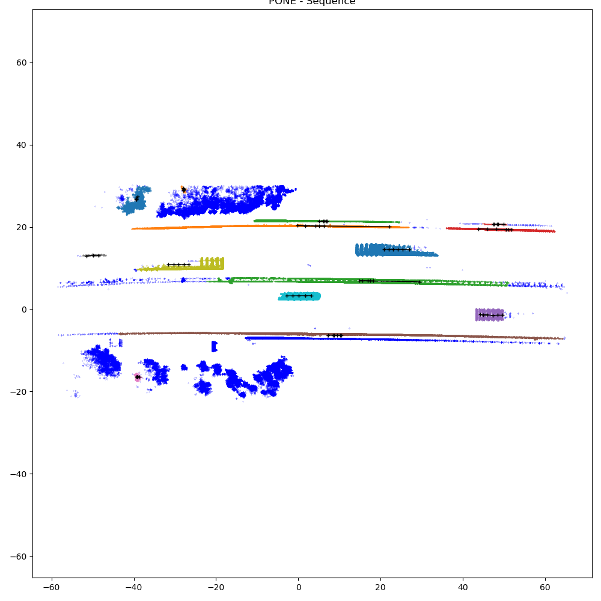

# 4D-ICP-flow

The script will load sample point cloud (x,y,z,scaled_time) and perform trajectory estimation and motion and instance segmentation. The installation is only via pip and the script run on CPU.

```
pip install matplotlib
pip install scikit-learn
pip install open3d
```

To use it, run the following command:

```
python icp-flow.py
```

The script describes the parameters and variable used to plotting for extraction of the output.

|Parameter| Description|
|---|---|
|EPS | DBSCAN parameters for grouping points, tunes over and undersegmentation|
|MAX_ADJACENT_TIMES | Number of consecutive time frames considered for DBSCAN clustering |
|Z_SCALE | Scaling the heights for clustering |
|MIN_NBR_PTS | Minimal number of instance points in all times for reconstruction consideration |
|MIN_INCLUDED_TIMES | The instance must have been observed in this many frames |

The main part of the script outputs the following variable that can be used for storing the results. The mask is mapping results to the loaded point cloud.

| Variable | Description |
|---|---|
| dynamic_mask| 0/1 if the point is static or dynamic |
| dynamic_id | indicates whether the instance is static or dynamic|
| trajectories | Trajectory coordinates per time |
| boxes_dict | Fitted Bounding box (x, y, z, l, w, h, theta)|

The PONE sample sequence can be than visualized as indicated in the script.

<p align="center">

<p>

For own data, it is recommended to load the points (x,y,z,t) into the **pts** variable and scale the time accordingly to the clustering (such as the comments in the script) or import the **ICP4dSolver** function into your framework.
